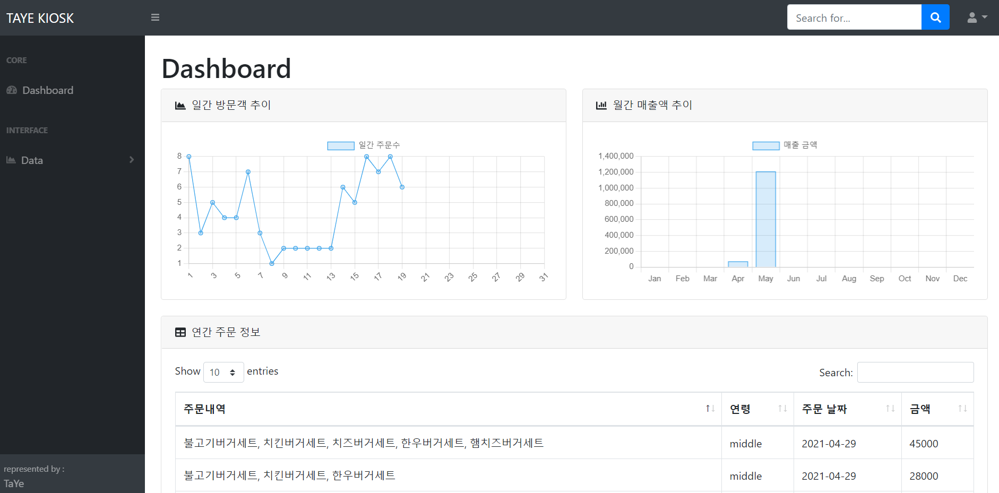
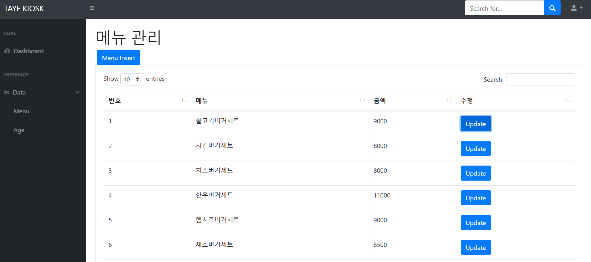
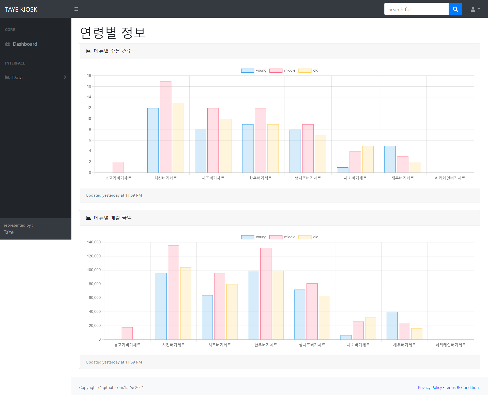
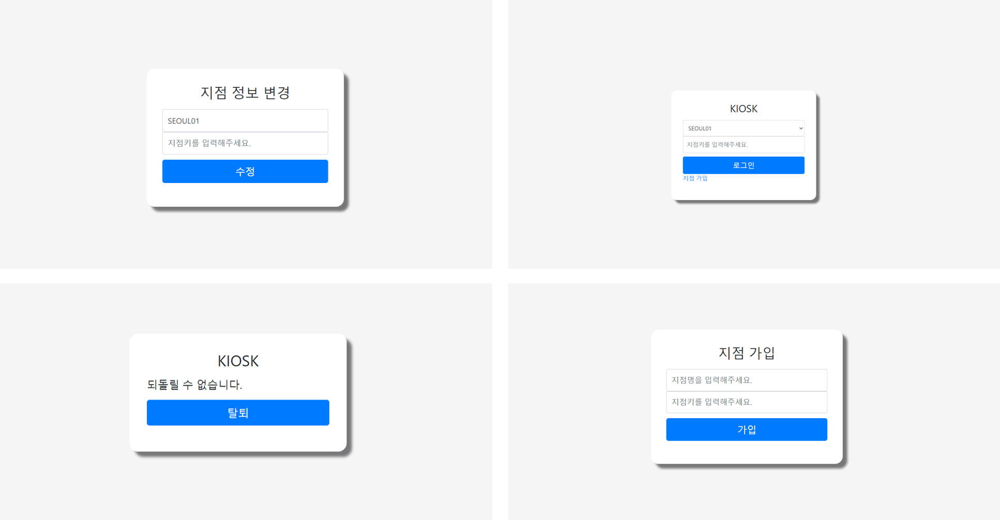
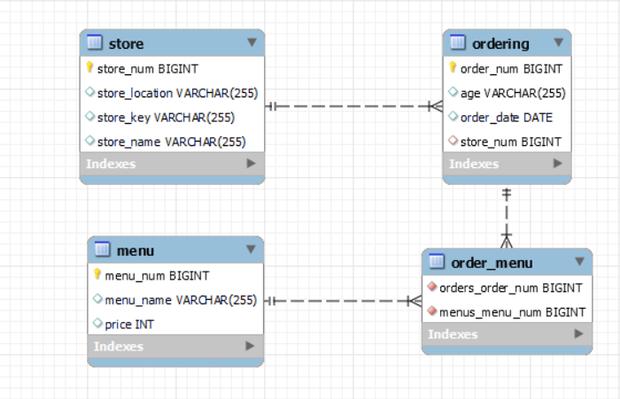

# 안면인식 기반 반응형 키오스크 Server

<a src="https://github.com/Ta-Ye/Kiosk_Program">안면인식 기반 반응형 키오스크</a>의 서버 및 백오피스

- 주문 정보 저장을 통한 인기 메뉴 API
- 매출, 연령별 선호 메뉴 등을 통한 데이터 제공 사이트

| :back: Back-end | :globe_with_meridians: Front-end |
|------|---|
|    |    |

<br>

## 페이지
<hr>

| 대시보드 | 메뉴 관리 |
|  |  |
| 연령별 데이터 | 지점 정보 관리 |
|  |  |

<br>

## Database Structure
<hr>



<br>

## Service
<hr>

### KIOSK Rest API
    - AuthenticationToken을 통한 권한부여 및 각각의 지점별 키오스크 식별
    - 주문 정보 저장
    - 전체/지점/연령별 인기 메뉴 제공

### KIOSK Back Office
#### 지점관리
    - 지점 가입
    - 지점 정보 수정
    - 메뉴 관리
#### 판매 데이터 제공
    - 일별 주문량 도표화
    - 월간 매출 도표화
    - 연간 주문 정보 도표화
    - 연령별 메뉴 선호도 도표화

<br>

## ISSUE
<hr>

### API용 Authentication과 BackOffice용 Authentication 구별 문제
    
    Backend에서 직접 관리하는 BackOffice의 경우 BasicAuthenication을 통해 Backend서버가 직접 관리한다.

    반면, RestAPI를 위한 Authentication은 따로 로그인하는 과정이 없다보니 Token으로 관리하기로 했다.

    따라서 WebSecurityConfigurerAdapter를 상속받는 Config가 각각 필요했다.
    그래서 BackOffice를 위한 SecurityConfig와
    KIOSK Program을 위한 MobSecurityConfig로 구현했다.

    각각의 Config는 @Order 를 통해 우선순위를 두어 순차적으로 진행될 수 있도록 했다.

### ManyToMany 관계 테이블을 위한 불필요한 Entity

```java
    @ManyToMany
    @JoinTable(name = "ORDER_MENU")
    private List<Menu> menus;
```
    Ordering과 menu의 정규화를 위해 관계 테이블을 만들어야 했다.
    하지만 따로 ORDER_MENU domain을 만드는 것은 불필요하므로
    ManyToMany, JoinTable을 통해 order_menu 테이블 자동 생성했다.
